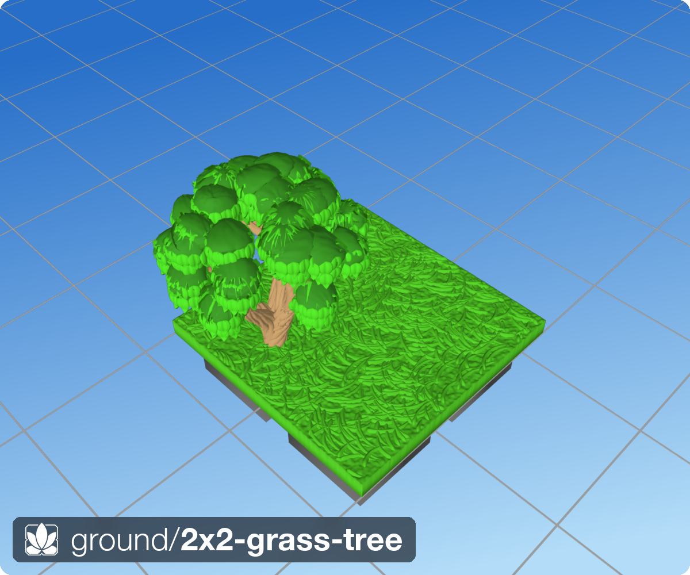
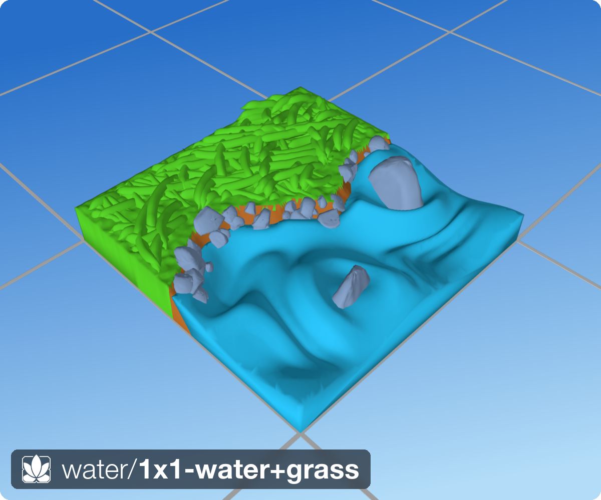
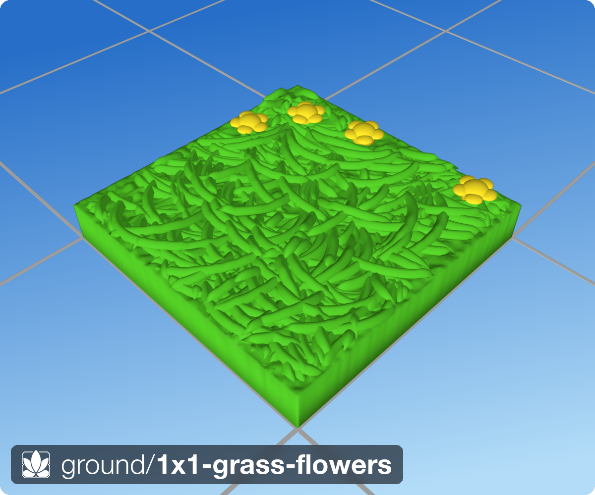
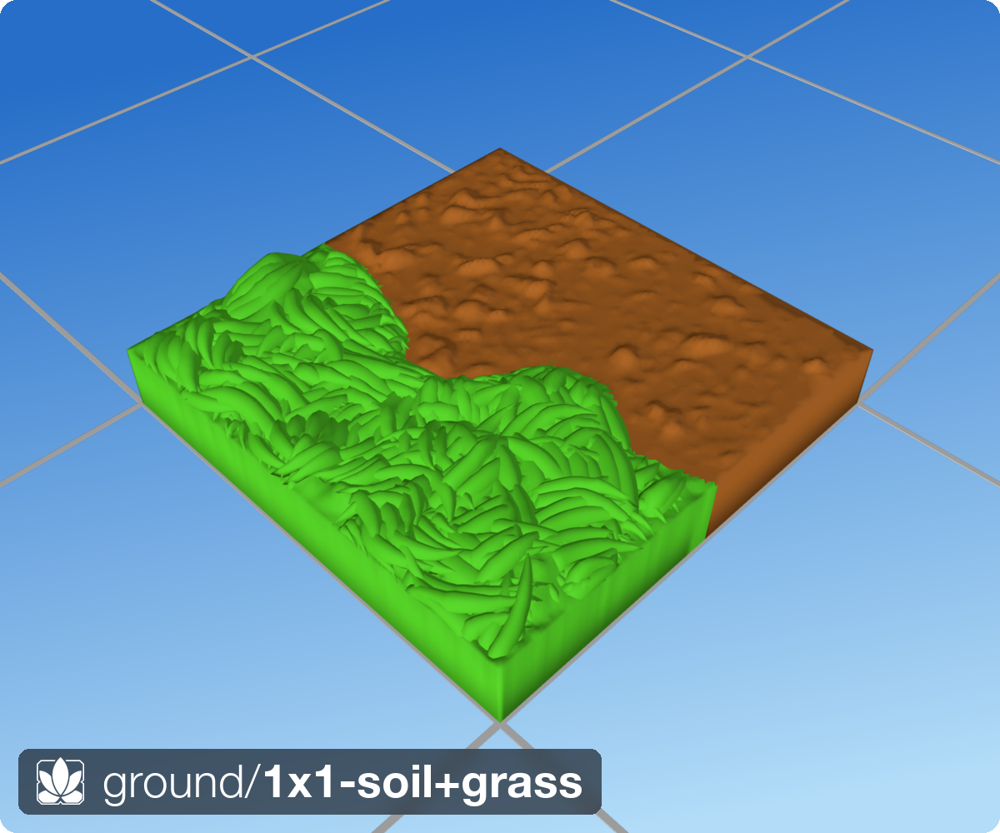
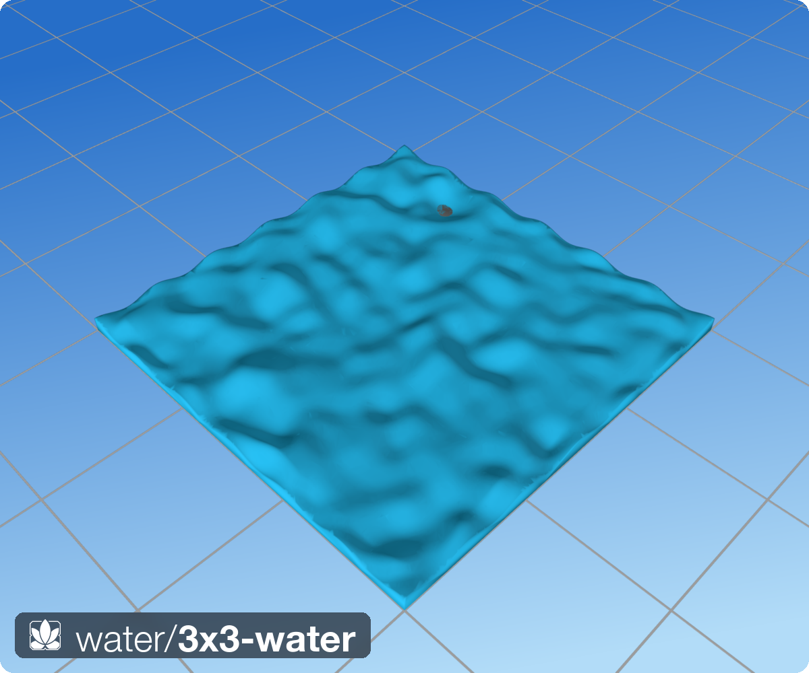
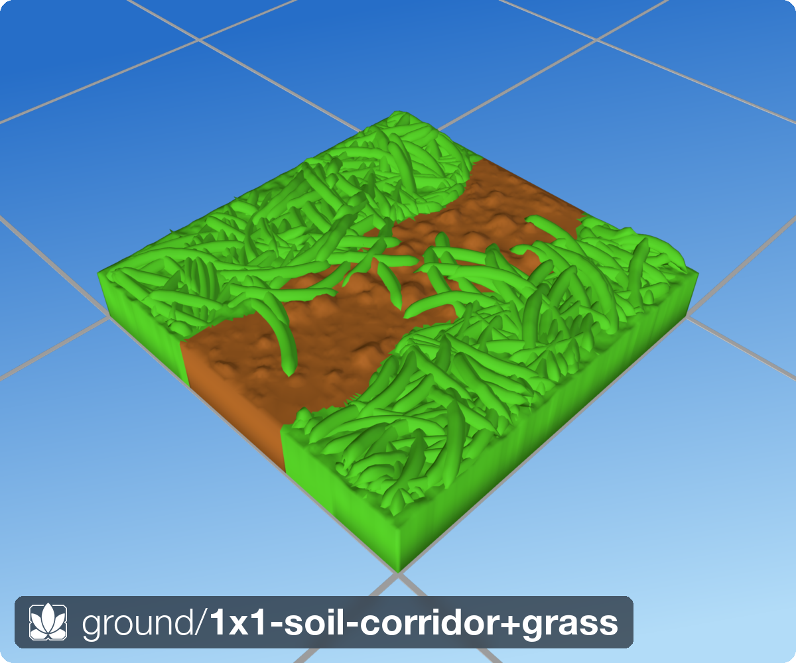

<p align="center">
  
</p>

# 🪷 dharmatiles

A procedural terrain generator for 3D printable tabletop tiles.

The basic idea is simple:

Instead of sculpting terrain directly, you describe a world in terms of regions, boundaries, materials, and growth rules, and the geometry emerges from that.

The output is a printable STL.

The interesting part is how it gets there.

---

## Renders

<table>
<tr>
  <td align="center"><br/><sub>2×2 meadow with tree</sub></td>
  <td align="center"><br/><sub>1×1 water + grass shoreline</sub></td>
  <td align="center"><br/><sub>1×1 grass with flowers</sub></td>
</tr>
<tr>
  <td align="center"><br/><sub>1×1 soil + grass</sub></td>
  <td align="center"><br/><sub>3×3 open water</sub></td>
  <td align="center"><br/><sub>1×1 soil corridor</sub></td>
</tr>
</table>

Renders are produced by the built-in pyrender pipeline. All tiles have a
DungeonBlocks or OpenLOCK compatible underside (socket-peg / T-slot).

---

## Why?

Most terrain systems work by placing objects.

Put a rock here.

Scatter some grass there.

Drop a tree somewhere nearby.

That works, but it tends to produce terrain that looks assembled.

I wanted something that behaved more like a place.

A rock should affect the grass around it.

Water should influence nearby terrain.

Boundaries should matter.

Things should interact.

So DharmaTiles treats terrain as a collection of systems rather than a collection of assets.

---

## How it works

At a high level:

```text
tile spec (.tile.py)
  → regions + boundaries
  → heightmap + masks
  → layers applied in order (soil, grass, rocks, trees, water…)
  → terrain solid
  → base attached (DungeonBlocks or OpenLOCK)
  → STL
```

A tile defines regions and boundaries.

Layers then use those regions to generate geometry.

Grass grows segment by segment, steering around rocks and other blades.

Water reshapes the terrain floor and emits a water-volume mesh.

Rocks stamp their footprint so that grass steers around them.

Trees are built via space-colonisation and stamped into the obstacle grid.

Everything contributes to a single final mesh.

The goal is that geometry is mostly a consequence of rules rather than explicit placement.

---

## Current systems

### Grass

Grass is generated from seed points.

Each blade grows incrementally while responding to nearby obstacles and neighbouring blades.

The result is not physically accurate, but it tends to produce clusters and directional behaviour that feel more natural than random scatter.

### Rocks

Rocks are vectorised half-ellipsoids scattered across the tile surface.

They occupy space and stamp an obstacle footprint so grass steers around them.

### Trees

Trees are built via space-colonisation skeleton growth.

Each tree is a branching tube mesh with configurable bark, foliage clusters, and leaves — all printable without supports.

### Flowers

Dome-on-column 3D flowers scattered using the same placement system as rocks.

### Water

Water is represented as a terrain layer rather than a separate object.

The pool floor is reshaped, ripples are added, and a water-volume mesh is emitted.

Shorelines blend into surrounding grass or soil.

### Soil

Soil is the quiet layer that makes everything else work.

Blob-textured height variation, terrain transitions, and blending all happen here.

---

## Design goals

### Printable first

The primary output is FDM printed terrain.

Everything is designed with printing in mind:

* minimal unsupported geometry
* durable features
* paintable surfaces
* clean silhouettes at tabletop scale

A terrain feature that looks great in a renderer but prints poorly is considered a bug.

### Deterministic generation

Given the same inputs and seed, the output is identical.

Terrain generation is procedural but reproducible.

### Emergence over placement

Whenever possible, systems produce results from local rules rather than explicit instructions.

Instead of saying:

> Put grass here.

the system tries to answer:

> Given this terrain, where would grass end up?

---

## Quick start

```bash
pip install -e .

# Generate every tile in src/tiles/ → stl/{db,ol}/
dharmatiles-gen

# Generate a single tile
dharmatiles-gen --tile src/tiles/ground/1x1-soil+grass.tile.py

# Suppress progress output
dharmatiles-gen --quiet
```

Then open the STL in PrusaSlicer, Bambu Studio, or your slicer of choice and print.

---

## Example tile spec

Tile specs are plain Python files. The spec language IS the implementation — no DSL, no YAML, no parsing step.

```python
from dharmatiles.spec    import Tile, Region, Boundary
from dharmatiles.core.config import SurfaceConfig, SpeciesConfig
from dharmatiles.layers  import GrassCarpet, Water
from dharmatiles.scatter import Rocks, Grass

species = SpeciesConfig()

tile = Tile(
    surface=SurfaceConfig(cols=1, rows=1, seed=42),
    areas=[
        Region(
            id='meadow',
            selector=FloodFill(0.25, 0.5),
            height_mm=5.0,
            layers=[
                GrassCarpet(species=species),
                Rocks(r_min=0.8, r_max=2.2),
                Grass(species=species),
            ],
        ),
        Boundary(width_mm=4.0),
        Region(
            id='lake',
            selector=FloodFill(0.75, 0.5),
            height_mm=3.0,
            layers=[
                Water(embed_mm=1.5),
            ],
        ),
    ],
)
```

Layer ordering in `Region.layers` is the state-dependency contract: `Rocks` before `Grass` so blades steer around placed rock footprints.

---

## Project structure

```text
src/dharmatiles/
  core/          pure primitives: heightmap, grid, region, mesh, config
  grass/         grass growth sub-pipeline
  scatter/       placement layers: Rocks, Grass, Flowers + distribution helpers
  layers/        terrain-texture layers: SoilCarpet, GrassCarpet, Water
  trees/         Tree generator (space-colonisation skeleton + tube mesh)
  bases/         DungeonBlocks, OpenLOCK base attachment
  terrains/      entry point: build_tile_from_spec() + CLI

src/tiles/
  ground/        ground tile specs (.tile.py)
  water/         water tile specs (.tile.py)

stl/             generated STL output (not in git — see stl/README.md)
png/             rendered previews
docs/            design notes and architecture reviews
```

---

## Status

Active development. The architecture is stable; the tile vocabulary is growing.

Current tile library: 35+ tile variants across ground and water categories, including corridors, corners, U-shapes, T-junctions, and cross-junctions in both grass and soil variants.

Output scale: 35 mm square grid (DungeonBlocks) and 25.4 mm square grid (OpenLOCK), generated in parallel from the same tile spec.
